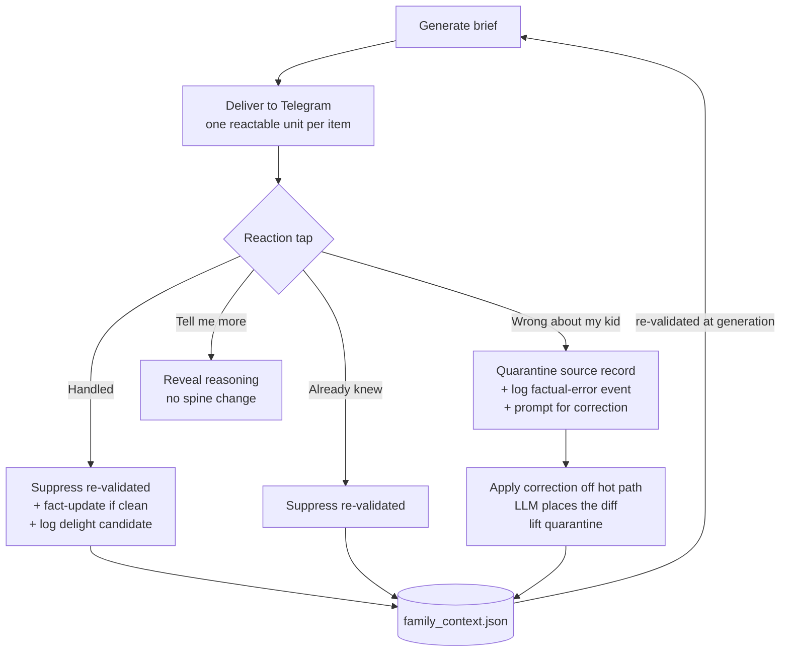

# Weekly Loop: Telegram Delivery + Reaction→Spine Feedback

## Summary

Deliver the weekly brief to Telegram with four inline reaction buttons per item, and make each tap deterministically update `family_context.json`. This closes the read → react → correct → learn loop that does not exist today: the brief currently generates into a file that goes unread, so nothing feeds back into the spine.

## Problem Frame

The forecasting pipeline works — engines run, candidates are assembled, ranked, suppressed, polished, and a brief is written to `briefs/`. But the brief lands in a file the user does not open as part of any weekly habit. Nothing downstream of generation exists: no channel, no reaction capture, no path from a reaction back into the context layer. The `feedback` table and `briefs.recipients` are scaffolded but unused.

Two consequences follow. First, the strategy's own "dead loop" warning is live — *a ritual that isn't opened isn't a ritual.* Second, the spine can only be maintained by hand-editing JSON, which is the single biggest friction in the product. Until the brief lands somewhere the user actually reads and can react to in one tap, neither the North Star (delight moments) nor the self-correcting context layer is reachable. This is the keystone: five of the seven ideas from the originating ideation depend on this loop existing.

## Key Decisions

- **Telegram is the delivery channel.** Chosen because *delivery*, not feedback capture, is the real bottleneck — the brief isn't read at all today. The channel must be one the user checks daily; Telegram's bot API also makes inline reaction buttons clean. The file/DB output remains as the system of record.
- **Full loop in V1.** Deliver + react + reaction→spine update ship together, rather than proving the read ritual first. The bet is that the user will read it once it's on Telegram.
- **Hybrid reaction→spine mapping.** A uniform, re-validated suppression layer applies to every item; deterministic fact-updates apply only to the cleanest cases (allergen → introduced, developmental milestone, well-visit date). This avoids building a per-engine reaction contract into all seven engines before the ritual is proven.
- **Reaction grammar replaces the placeholder `feedback` enum.** The four action tokens (Handled, Already knew, Wrong about my kid, Tell me more) each map to a spine operation, replacing the unused `hit / handled / irrelevant / surprise` enum.
- **A "Wrong" tap corrects, not just contains.** It quarantines the cited record immediately *and* prompts for the correct value, which is applied off the hot path and lifts the quarantine — chosen over quarantine-only because a corrected fact is strictly better than one left wrong until a manual fix.
- **Suppression is re-validated, not permanent.** A suppressed trigger carries a condition re-checked at generation time and resurfaces when the condition no longer holds (e.g., shoe-size resurfaces at the next band). This follows the stateful-workflow learning: re-check "does this still hold?" at generation rather than carrying mute state forever.
- **One LLM step, off the hot path.** Suppression, delight logging, and quarantine are fully deterministic. The only LLM in the loop translates a free-text correction reply into a spine diff at the right path, and it runs off the hot path — preserving the "no LLM on the hot path" property the user wanted.

## Actors

- A1. **The user (Nick)** — single V1 reader; taps reactions, supplies corrections.
- A2. **The brief bot** — delivers the brief to Telegram and captures reactions/replies.
- A3. **The trigger engines** — emit candidates carrying a suppression key (and, where clean, a fact-update target).
- A4. **The spine** (`family_context.json`) — the durable record reactions mutate and that re-validation reads at generation.

## Key Flows

- F1. Weekly delivery
  - **Trigger:** A brief is generated for the week.
  - **Actors:** A2
  - **Steps:** Each assembled item is sent to the Telegram chat as its own reactable unit, with four inline controls and the item's headline/body/suggested action; the "why this fired" reasoning stays collapsed until requested.
  - **Outcome:** The brief is present in the channel the user checks; delivery is confirmed before the brief is marked delivered.
  - **Covers:** R1, R2, R3, R4

- F2. Handled
  - **Trigger:** User taps ✓ Handled on an item.
  - **Actors:** A1, A4
  - **Steps:** Record a re-validated suppression on `(kidId, triggerDetail)`; if the item type has a clean target, apply the fact-update; log a delight candidate tagged with the item's engine and cited records.
  - **Outcome:** The item stops recurring until its condition changes; a delight signal is captured.
  - **Covers:** R5, R8, R9, R10, R11

- F3. Already knew
  - **Trigger:** User taps 🔕 Already knew.
  - **Actors:** A1, A4
  - **Steps:** Record a re-validated suppression; for developmental items, record the milestone as cleared / add to `things_we_already_know`. No delight is logged (it wasn't new).
  - **Outcome:** A known item is muted until re-validation resurfaces it.
  - **Covers:** R8, R9, R10

- F4. Wrong about my kid → correct
  - **Trigger:** User taps ✗ Wrong about my kid.
  - **Actors:** A1, A2, A4
  - **Steps:** Immediately quarantine the cited source record so no engine fires off it; log a factual-error event; the bot asks once for the correct value; the user's one-shot reply is applied to the spine off the hot path and the quarantine is lifted.
  - **Outcome:** The wrong fact stops re-firing instantly and is corrected within a cycle.
  - **Covers:** R6, R12, R13, R14

- F5. Tell me more
  - **Trigger:** User taps 💬 Tell me more.
  - **Actors:** A1
  - **Steps:** Reveal the item's stored reasoning in-channel.
  - **Outcome:** The user sees provenance; no spine change; not a conversation.
  - **Covers:** R6

## Requirements

**Delivery**

- R1. The weekly brief is delivered to a Telegram chat as the canonical read surface; existing file + DB persistence remains the system of record.
- R2. Each brief item is delivered as an individually reactable unit so a reaction binds to exactly one brief item.
- R3. Each delivered item presents four inline reaction controls: Handled, Already knew, Wrong about my kid, Tell me more.
- R4. Delivery is reliable: failures retry, and a brief is not considered delivered until it reaches the channel.

**Reaction grammar & capture**

- R5. The four reactions replace the placeholder feedback ratings; every reaction is persisted against its brief item with a timestamp.
- R6. "Tell me more" reveals the item's stored reasoning in-channel and performs no spine mutation; the correction reply on a "Wrong" tap is a single annotation, not an ongoing conversation.
- R7. Reactions are idempotent per item: re-tapping the same reaction does not double-apply its effect.

**Spine mapping**

- R8. Every item supports generic suppression keyed by `(kidId, triggerDetail)`; both "Handled" and "Already knew" add a suppression.
- R9. Suppressions carry a re-validation condition and are re-checked at generation time, never carried as permanent mute state; a suppressed trigger resurfaces once its condition no longer holds.
- R10. For item types with a clean deterministic target, the matching reaction also applies a fact-update: allergen window → move the allergen to introduced; developmental window → record the milestone as cleared / add to `things_we_already_know`; well-visit absence → advance the next-due marker.
- R11. "Handled" logs a delight candidate tagged with the item's engine and cited records; "Already knew" does not.

**Trust & the counter-metric**

- R12. "Wrong about my kid" immediately quarantines the cited source spine record so no engine fires off it until it is corrected, and logs a factual-error event toward the zero-error counter-metric.
- R13. The same tap prompts for the correct value as a one-shot reply; the reply is applied to the spine off the hot path and the quarantine is then lifted.
- R14. Applying a free-text correction is the only place an LLM enters the loop, and it runs off the hot path; suppression, delight logging, and quarantine are fully deterministic.

## Acceptance Examples

- AE1. Re-validated suppression resurfaces
  - **Covers R8, R9.**
  - **Given** the user tapped "Already knew" on an `outgrowing:shoes` item at size band N,
  - **When** a later measurement crosses into band N+1,
  - **Then** the next brief surfaces the shoe-size item again rather than staying muted.

- AE2. Wrong fact stops re-firing across engines
  - **Covers R12, R13.**
  - **Given** the user taps "Wrong about my kid" on an item citing a stale weight,
  - **When** the next brief generates before a correction is supplied,
  - **Then** no item — from any engine — fires off the quarantined weight record; and once the user replies with the correct weight, the record is updated and the quarantine lifts.

- AE3. Handled applies a fact-update and logs delight
  - **Covers R10, R11.**
  - **Given** an `allergen_window:peanut` item,
  - **When** the user taps "Handled,"
  - **Then** peanut moves from `not_yet_introduced` to `introduced` in the spine, a delight candidate is logged, and the item is suppressed.

- AE4. Already knew suppresses without delight
  - **Covers R11.**
  - **Given** any item,
  - **When** the user taps "Already knew,"
  - **Then** the item is suppressed but no delight candidate is recorded.

## Success Criteria

- **Read-through.** The brief is opened in Telegram each week without prompting — the direct test that the loop is not dead. This is the primary thing V1 must prove.
- **Delight signal exists.** "Handled" taps produce delight candidates, giving the North Star a captured signal instead of a hand-kept log (target context: 4 delight moments in 8 consecutive weeks).
- **Zero factual errors, contained.** Every "Wrong" tap is logged and resolves to a correction; no quarantined record re-fires in a subsequent brief. The counter-metric trends to zero and a single error never recurs weekly.
- **Loop closure is observable.** A reaction measurably changes the next brief: suppressed items do not recur unless re-validation resurfaces them, and corrected facts are reflected.

## Scope Boundaries

**Deferred for later**

- Rich, multi-field or conversational corrections — V1 handles a single-value one-shot correction reply.
- New capture sources feeding the spine (calendar-as-sensor, medical-portal / nanny-text ingestion).
- The other ideation survivors (baseline-deviation engine, reorder-point forecasting, structured KB layer, automated delight→ranking) — separate work that builds on this loop.

**Outside this product's identity**

- Not a chat app — the correction reply is a one-shot annotation, never a back-and-forth conversation.
- Not a task manager — reactions express knowledge state (handled / known / wrong), not assignments or to-dos.
- Not multi-user yet — Mika is deliberately not a user in V1; the delight signal's "before the primary planner raised it" qualifier stays the user's own judgment until a multi-actor signal exists.

## Dependencies / Assumptions

- Requires a Telegram bot (token + target chat) and infrastructure to receive reaction callbacks and reply messages.
- Assumes the engines can expose a stable suppression key per candidate, and a fact-update target for the clean cases — today's `Candidate` does not carry this; adding it is in scope for planning.
- Assumes the existing time-windowed cross-engine suppression (`firedInLast`) generalizes to condition-based re-validation.
- Load-bearing bet: the user reads the brief once it's on Telegram. The read-through success criterion is the explicit test of this assumption; if it fails, the channel choice — not the loop design — is what to revisit.
