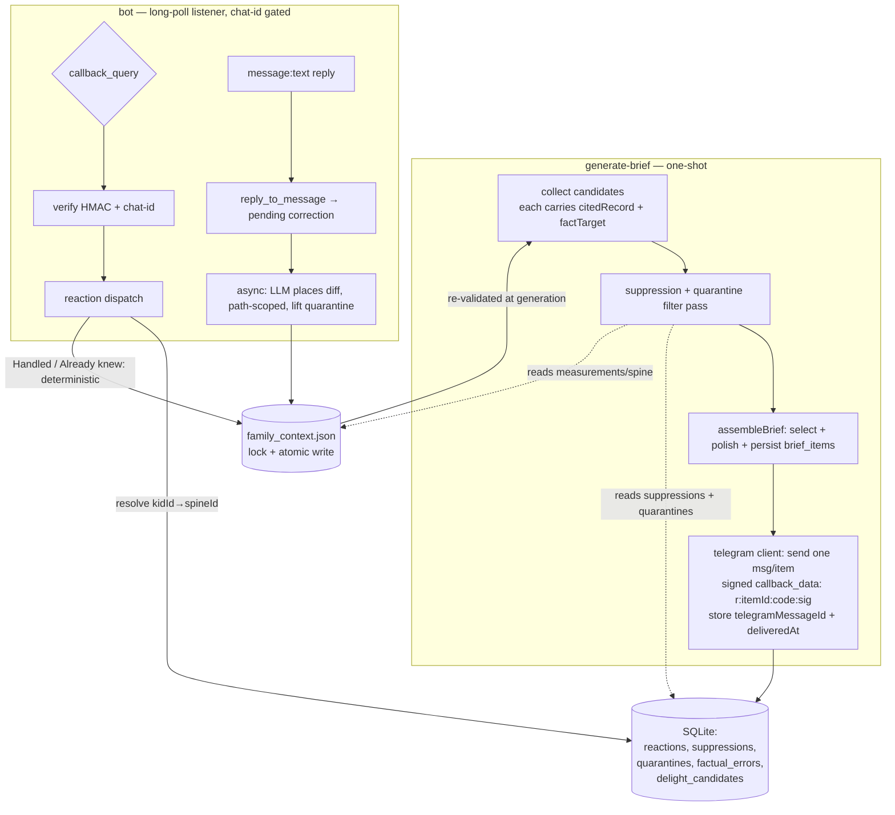
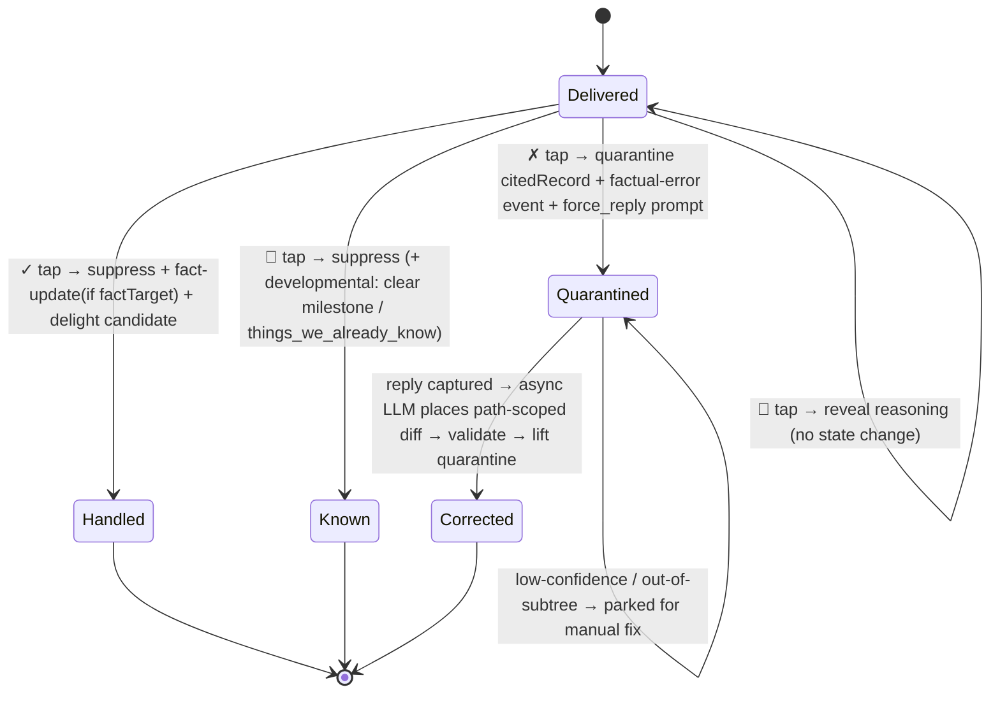

# feat: Weekly loop — Telegram delivery + reaction→spine feedback

## Summary

Deliver the weekly brief to Telegram with four inline reaction buttons per item, and turn each tap into a deterministic update to `family_context.json`. A "Wrong about my kid" tap quarantines the cited record, logs a factual-error event, and prompts for a one-shot correction applied off the hot path. This closes the read → react → correct → learn loop that does not exist today (see origin: `docs/brainstorms/2026-06-05-weekly-loop-requirements.md`).

## Problem Frame

The generation pipeline works end-to-end — engines → assembler → polish → render → persist — but the brief lands in `briefs/<weekOf>.md`, a file the user does not open. Nothing downstream of generation exists: no channel, no reaction capture, no path from a reaction back into the spine. The `feedback` table and `briefs.recipients` are scaffolded but unused, and `src/lib/context.ts` is read-only — there is no writer to the spine at all.

Two structural facts shape this plan. First, every existing entrypoint in `src/cli/` is a one-shot script that parses args, does work, and exits; there is no daemon, inbound server, or process manager. Reaction capture requires the first long-running process in the codebase. Second, the spine is a single JSON document read field-by-field across seven engines; there is no single read chokepoint to gate and no write path to extend. Both are net-new shapes, so the plan treats them as first-class units rather than incidental edits.

A third fact, surfaced during review, governs the whole reaction→spine path: the brief item a user taps must carry a **machine-readable pointer back to the exact spine record it came from**, and the two id-spaces in this codebase (DB integer `kidId` vs. spine string id like `kid_a`) must be bridged explicitly. Today neither exists — `triggerDetail` (e.g. `allergen:start`) is too coarse to name the specific record, and `brief_items.kidId` is a DB integer with no link to the spine kid. The citation contract (KTD below) is the spine on which suppression, fact-updates, and quarantine all depend.

---

## Key Technical Decisions

- **Telegram client: grammY (`grammy@^1.43`) with long polling.** grammY is the only actively-maintained, TypeScript-native option in 2026. Long polling (not webhooks) avoids needing a public HTTPS endpoint, which the CLI/scheduled app cannot provide; Telegram queues updates ~24h server-side, so an intermittently-run listener loses no taps. (see Sources)
- **Two processes, not one.** Delivery is a step inside the existing one-shot `generate-brief` (items are already persisted with stable ids before send). Reaction capture is a separate long-running listener (`npm run bot`) — the first daemon in the repo. Keeping them separate preserves the one-shot nature of generation and isolates the new process shape.
- **Candidate citation contract (load-bearing — resolves the coarse-`triggerDetail` problem).** Every engine stamps each `Candidate` with a structured `citedRecord` — the spine kid id plus the spine path (or DB ref) the candidate reasoned from — and, for the clean fact-update cases, a `factTarget` naming the precise mutation (e.g. `{kind:"allergen", allergen:"peanut"}`, `{kind:"milestone", id:"..."}`, `{kind:"well_visit"}`). Both are persisted on `brief_items`. Reactions read these fields; they do **not** parse `triggerDetail`. This is required because `triggerDetail` is too coarse: the allergen engine emits only `allergen:start`/`allergen:continue` (one item covers all un-introduced allergens), so "which allergen did the user mark handled?" is unanswerable without an explicit target. The same `citedRecord` is what quarantine and suppression match against.
- **Kid identity resolution.** `brief_items.kidId` is the DB integer; spine mutators operate on the spine string id (`kid_a`). Every reaction resolves DB→spine id before any spine write — via a new stable `spineId` column on the `kids` table (preferred; set at `add-kid`/`seed` time), falling back to the existing name-match bridge used by `cross_products.ts`. Suppression/quarantine rows store the spine id. Without this, spine mutators silently no-op against a non-existent kid.
- **Hybrid reaction→spine mapping.** A uniform, re-validated suppression layer applies to every item; deterministic fact-updates apply only to the cleanest cases (allergen → introduced, developmental milestone, well-visit date), driven by the `factTarget` field above. This satisfies "every item supports suppression" (R8) without a per-engine reaction contract — engines only need to populate `citedRecord`/`factTarget`, not implement reaction handling.
- **Reaction grammar replaces the placeholder `feedback` enum.** The four action tokens (Handled, Already knew, Wrong about my kid, Tell me more) each map to a spine operation, replacing the unused `hit/handled/irrelevant/surprise` enum. The `feedback` table is left in place but unused and marked deprecated in a schema comment (removal is deferred follow-up).
- **Re-validated suppression, not permanent mute.** A suppression row stores a `revalidationKind` + `revalidationParams` re-checked at generation; the item resurfaces when the condition no longer holds. Defaults per trigger family: `outgrowing:*` → `measurement_band` (the size band at suppression time); `developmental:*` → `until_milestone_change` (resurfaces only if the milestone status regresses); `vaccine_prep`/`absence:*` → `until_date`; everything else → `forever` (suppressed until the user explicitly un-suppresses or the record changes). When a `measurement_band` predicate finds no measurement for that kid/dimension, it treats the condition as still-holding (stays suppressed) — resurfacing requires a concrete new measurement.
- **Quarantine is keyed on `citedRecord`, scoped to the clean cases, and redacted from cross-products.** "Wrong" writes a quarantine on the tapped item's `citedRecord` (spine id + path). The suppression filter drops any later candidate whose `citedRecord` matches an active quarantine. Because `cross_products` sends the whole spine to Claude, the quarantined subtree is **redacted from the cross-products context payload** so the LLM cannot reason off a known-bad fact. R12/AE2 are scoped accordingly (see Requirements): the guarantee is "no item citing the quarantined record, and no cross-products item, fires off it" — not a universal interceptor on every possible read.
- **Spine writes are atomic AND serialized.** The mutator reads the full raw JSON, mutates the parsed object, updates `last_updated`, writes to a temp file, validates it re-parses via `loadFamilyContext`, then renames over the original. Atomic rename prevents torn reads; a **file lock (`proper-lockfile` or `O_EXCL`) around the whole read-modify-write** prevents lost updates when the listener and `generate-brief` write concurrently. As a backstop, the mutator re-reads and aborts/retries if the file's `sha256` changed since its read (optimistic concurrency; the loader already computes `sha256`).
- **Inbound authorization (children's data — not optional).** The bot accepts callback queries and replies **only from the configured `TELEGRAM_CHAT_ID`**, enforced as a grammY middleware that runs before any handler. Without it, anyone who reaches the bot could drive spine mutations on a child's medical records.
- **Tamper-resistant callback data.** `callback_data` is `r:<briefItemId>:<code>:<sig>` where `sig` is a truncated base64url HMAC-SHA256 over `briefItemId:code` keyed by a per-deployment secret (fits the 64-byte limit). The listener verifies the signature before acting, preventing forged/enumerated reactions against arbitrary past items. Combined with the chat-id allowlist (one gates *who*, the other gates *what*).
- **One LLM step, off the hot path, path-scoped.** Suppression, delight logging, quarantine, and the clean fact-updates are fully deterministic. The only model call translates a free-text correction into a spine diff; it runs off the hot path, and the proposed diff path **must resolve within the corrected kid's subtree** (asserted before write) — any out-of-subtree or ambiguous path is parked (left quarantined) for manual fix, never guessed.
- **Correction applier runs inside the bot process, asynchronously.** After the bot acks a correction reply, it enqueues and processes the correction off the event-loop tick within the same daemon — no separate manually-run CLI, no scheduler. This is the only viable "off the hot path" mechanism given the bot is the sole long-running process.
- **Idempotency keyed on Telegram identifiers.** Reaction writes upsert on `(briefItemId, reaction)` and dedupe on `callback_query.id`; the message keyboard is edited away after the first tap. Correction replies are first-write-wins: accepted only when the target reaction is `pending` with null `correctionText`, deduped on reply `message_id`. Re-taps and ~24h-backlog redeliveries converge to the same end state (R7).
- **Test harness: introduce `node:test` (zero new deps, runs under `tsx`).** The repo has no test runner today (only fixtures + `--dry-run`). Pure logic (suppression predicates, reaction→op mapping, callback_data encode/sign/verify, spine mutator, kid-id resolution) gets `node:test` specs via a new `test` script; I/O-bound paths (actual send, long-poll) are verified via a dry-run/fixture path and manual check.

Reaction state machine (one per brief item):

Each transition re-confirms preconditions at the moment it fires (record still exists, not already quarantined, suppression not already present) rather than trusting state captured when the brief was sent.

---

## Data Exposure & Trust Boundary

The weekly brief and correction replies carry children's sensitive data — allergens, developmental status, medical-visit history, growth measurements. Delivery sends this to **Telegram, a third-party service that persists message history indefinitely by default.** This is an accepted V1 risk, with these mitigations and acknowledgments:

- The data already lives in the local spine; Telegram is the delivery surface. V1 accepts Telegram cloud persistence rather than building a self-hosted channel.
- Send only what each item needs — derived, human-readable text, not raw record dumps where avoidable.
- The `TELEGRAM_BOT_TOKEN` is a write-capable credential and `TELEGRAM_CHAT_ID` completes the inbound-forgery surface; both live in `.env`, which must be gitignored (verify), and the token is rotated via BotFather `/revoke` if exposed.
- Correction replies the user types also transit Telegram — the user is implicitly the one choosing to send them.

Deferred (not V1): a Telegram auto-delete timer on the bot chat, and a redaction policy for the most sensitive fields.

---

## Requirements

Carried from origin (`docs/brainstorms/2026-06-05-weekly-loop-requirements.md`). R12 wording is scoped to the enforceable guarantee (see the quarantine KTD).

**Delivery**
- R1. The weekly brief is delivered to a Telegram chat as the canonical read surface; file + DB persistence remains the system of record.
- R2. Each brief item is delivered as an individually reactable unit so a reaction binds to exactly one brief item.
- R3. Each delivered item presents four inline controls: Handled, Already knew, Wrong about my kid, Tell me more.
- R4. Delivery is reliable: failures retry, and a brief is not considered delivered until it reaches the channel.

**Reaction grammar & capture**
- R5. The four reactions replace the placeholder feedback ratings; every reaction is persisted against its brief item with a timestamp.
- R6. "Tell me more" reveals the item's stored reasoning in-channel and performs no spine mutation; the correction reply on a "Wrong" tap is a single annotation, not an ongoing conversation.
- R7. Reactions are idempotent per item: re-tapping does not double-apply; correction replies are first-write-wins.
- R15. The bot processes callback queries and replies only from the authorized chat; callback data is signed and verified before any action. (added in review)

**Spine mapping**
- R8. Every item supports generic suppression keyed by `(kidId, triggerDetail)`; both "Handled" and "Already knew" add a suppression.
- R9. Suppressions carry a re-validation condition and are re-checked at generation time, never carried as permanent mute state; a suppressed trigger resurfaces once its condition no longer holds.
- R10. For item types with a clean deterministic target (named by the candidate's `factTarget`), the matching reaction also applies a fact-update: allergen → move that allergen to introduced; developmental → record the milestone as cleared / add to `things_we_already_know`; well-visit → advance the next-due marker.
- R11. "Handled" logs a delight candidate tagged with the item's engine and cited records; "Already knew" does not. (The delight candidate is a "Handled" proxy; the North Star's "before the planner raised it" qualifier remains manual in V1 — read it as an upper bound.)

**Trust & the counter-metric**
- R12. "Wrong about my kid" immediately quarantines the cited source record (by `citedRecord`) so no item citing that record — and no cross-products item, via payload redaction — fires off it until corrected, and logs a factual-error event toward the zero-error counter-metric.
- R13. The same tap prompts for the correct value as a one-shot reply; the reply is applied to the spine off the hot path (async, within the bot) and the quarantine is then lifted.
- R14. Applying a free-text correction is the only place an LLM enters the loop; it runs off the hot path and its diff is path-scoped to the corrected kid's subtree. Suppression, delight logging, and quarantine are fully deterministic.

---

## Implementation Units

Units are listed in dependency order; U-IDs are stable identifiers and do not imply build sequence beyond the explicit Dependencies on each unit.

### U1. Schema additions + push
**Goal:** Add the persistence the loop needs and apply it to the local DB.
**Requirements:** R5, R7, R8, R9, R10, R11, R12, R13, R15; supports R1–R4.
**Dependencies:** none
**Files:** `src/lib/db/schema.ts` (modify), then `npm run db:push`
**Approach:** Add tables, each with autoincrement `id` and `createdAt`:
- `reactions` — `briefItemId` FK, `reaction` enum (`handled | already_knew | wrong | tell_more`), `telegramCallbackId` (dedupe), `promptMessageId` (nullable; force_reply correlation), `replyMessageId` (nullable; reply dedupe), `correctionText` (nullable), `appliedStatus` (`n/a | pending | applied | parked`).
- `suppressions` — `kidSpineId` (string), `triggerDetail`, `revalidationKind` (`measurement_band | until_milestone_change | until_date | forever`), `revalidationParams` (json), `sourceReactionId` (nullable FK).
- `quarantines` — `kidSpineId`, `recordPath` (the cited spine path), `reason`, `active` (bool), `liftedAt` (nullable).
- `factual_errors` — `briefItemId`, `kidSpineId`, `citedRecord` (json), `resolvedAt` (nullable).
- `delight_candidates` — `briefItemId`, `kidSpineId`, `triggerDetail` (engine attribution). Raw-signal store only; no V1 consumer reads it (automated delight→ranking is deferred per origin).
Add columns to `brief_items`: `telegramMessageId` (nullable int), `deliveredAt` (nullable text), `citedRecord` (json: `{kidSpineId, path}`), `factTarget` (json, nullable: the clean-case mutation descriptor). Add a stable `spineId` (text) column to `kids`. Add `$inferSelect`/`$inferInsert` exports for each new table. Add a deprecation comment on the existing `feedback` table (superseded by `reactions`; do not write to it).
**Patterns to follow:** existing `sqliteTable` definitions, enum-as-`text({enum})`, index helpers, type-export block at the bottom of `src/lib/db/schema.ts`.
**Test scenarios:** `Test expectation: none — schema + push only.` Verify `npm run db:push` applies cleanly and `npm run check` passes.
**Verification:** `db:push` reports the new tables/columns; `db:studio` shows them; `tsc --noEmit` clean.

### U1b. Populate citation fields on candidates
**Goal:** Have every engine stamp `citedRecord` and (where clean) `factTarget` on the candidates it emits, and resolve kid spine ids.
**Requirements:** R8, R10, R12 (enables the citation contract)
**Dependencies:** U1
**Files:** `src/lib/engine/types.ts` (extend `Candidate`), each `src/lib/engine/*.ts` emitter (modify), `src/cli/add-kid.ts` + `src/cli/seed.ts` (set `kids.spineId`), `tests/citation.test.ts` (new)
**Approach:** Extend `Candidate` with `citedRecord: {kidSpineId, path}` and `factTarget?: {kind, ...}`. Each engine sets these from what it already reads: allergen engine sets `factTarget:{kind:"allergen", allergen}` per specific allergen (this may mean emitting one candidate per still-missing allergen, or carrying the allergen list on a single candidate's factTarget — pick per the allergen engine's current shape); developmental sets `{kind:"milestone", id}`; absence sets `{kind:"well_visit"}`; outgrowing/vaccine/medication set `citedRecord` only (suppression-only, no clean factTarget). Backfill `kids.spineId` for existing kids.
**Patterns to follow:** the per-engine `Candidate` construction sites; `cross_products.ts` name-match bridge as the fallback id resolver.
**Test scenarios:**
- Happy: each engine's emitted candidate carries a non-empty `citedRecord` with a resolvable `kidSpineId`.
- Happy: an allergen "start" item carries a `factTarget` naming a specific allergen (or the set), not just `allergen:start`.
- Edge: a kid with no `spineId` set resolves via name fallback; a name with no spine match surfaces a clear error rather than a silent null.
**Verification:** specs pass; `generate-brief --dry-run` shows candidates with populated citation fields.

### U2. Spine mutator + quarantine helpers
**Goal:** The first writer to `family_context.json` — atomic, locked, path-scoped — plus quarantine read/write.
**Requirements:** R10, R12, R13, R14
**Dependencies:** U1
**Files:** `src/lib/spine_write.ts` (new), `tests/spine_write.test.ts` (new); `package.json` (add `proper-lockfile`); reads existing `src/lib/context.ts`
**Approach:** Read-modify-write the full raw parsed JSON (never the Zod-narrowed view, so loose-inside fields survive), update top-level + section `last_updated`, serialize 2-space, write temp, re-validate via `loadFamilyContext`, atomically rename. Wrap the whole RMW in a file lock; as a backstop, abort/retry if the file `sha256` changed since the read. All mutators take the **spine string id**. Export `markAllergenIntroduced(kidSpineId, allergen)` (moves between `not_yet_introduced`/`introduced`), `clearMilestone`/`addThingWeAlreadyKnow`, `advanceWellVisitDue` (writing the single canonical well-visit path — reconcile the absence engine's `medical.next_well_visit` read and the example's `medical.health.next_well_visit_due` onto one path first), and `applySpineDiff(kidSpineId, path, value)` used only by the LLM correction path, which **asserts `path` resolves within `kidSpineId`'s subtree** and rejects otherwise. Add `quarantineRecord(kidSpineId, recordPath, reason)`, `liftQuarantine(id)`, `activeQuarantines(kidSpineId)`.
**Patterns to follow:** `saveToken`/`writeBriefLog` 2-space writes; `loadFamilyContext` `LoadResult` union + `sha256`; loose-inside/strict-outside contract.
**Test scenarios:**
- `Covers AE3 (fact-update side).` Happy: `markAllergenIntroduced` moves `peanut` between arrays; file still loads.
- Edge: unknown/loose fields survive a write untouched.
- Edge: `addThingWeAlreadyKnow` idempotent on repeat.
- Error: a mutation producing invalid JSON/schema is rejected; original left intact.
- Error: `applySpineDiff` with a path outside the kid's subtree is rejected (path-scope assertion).
- Integration: two interleaved read-modify-write cycles (lock contention) both land with no lost update; sha256-changed backstop triggers a retry.
**Verification:** specs pass; manual mutate-then-`generate-brief --dry-run` reflects the change with no schema break.

### U3. Telegram client module
**Goal:** A configured grammY client that sends a reactable, signed item and exposes message-edit helpers, degrading gracefully when unconfigured.
**Requirements:** R1, R2, R3, R6, R15
**Dependencies:** U1
**Files:** `src/lib/telegram.ts` (new), `tests/telegram_callback.test.ts` (new); `package.json` (add `grammy` dependency only — the `bot` script is owned by U5); `.env` (`TELEGRAM_BOT_TOKEN`, `TELEGRAM_CHAT_ID`, `TELEGRAM_CALLBACK_SECRET`)
**Approach:** Wrap `new Bot(token)`; read token/chat-id/secret from env. Mirror `src/lib/calendar.ts`'s non-throwing status union (`{status:"ok"|"not_configured"|"error"}`) and a `TelegramNotConfiguredError` analogous to `GoogleNotConfiguredError`. Export `sendItem(item)` building an `InlineKeyboard` with signed `callback_data` = `r:<briefItemId>:<code>:<sig>` (codes `handled|knew|wrong|more`; `sig` = truncated base64url HMAC-SHA256 of `briefItemId:code` under `TELEGRAM_CALLBACK_SECRET`, sized to stay ≤64 bytes), returning the sent `message_id`. Export `signCallback`/`verifyCallback`, `editItemAfterReaction`, `removeItemKeyboard`, `promptForReply` (force_reply). Provide a dry-run/no-send mode paralleling the calendar fixture override. Confirm `.env` is gitignored (verification step) and document token rotation.
**Patterns to follow:** `src/lib/google.ts` typed-error + status-union; `.env`/`--env-file`; `.js` import extensions.
**Test scenarios:**
- Happy: `signCallback`→`verifyCallback` round-trips; tampered payloads fail verification.
- Edge: signed payload stays ≤64 bytes for large brief-item ids.
- Error: missing token → `not_configured`, no throw.
- `Test expectation: live send/edit verified manually` (network I/O not unit-tested).
**Verification:** with a real token, `sendItem` posts a message with four buttons; encode/sign/verify specs pass; `not_configured` warns without crashing.

### U4. Delivery step in generate-brief
**Goal:** Send each assembled item to Telegram and record delivery, without breaking the one-shot flow.
**Requirements:** R1, R2, R4
**Dependencies:** U1, U3
**Files:** `src/cli/generate-brief.ts` (modify)
**Approach:** After `assembleBrief` returns persisted `items`, iterate and `sendItem`; on success persist `telegramMessageId` + `deliveredAt`. Skip under `--dry-run`. On `not_configured`, warn and continue (mirror the calendar branch). For R4: retry a failed send a small bounded number of times; do not set `deliveredAt` unless the send succeeded; summarize delivered/failed counts.
**Patterns to follow:** existing calendar `not_configured`/`error` branch; end-of-run console summary.
**Test scenarios:**
- Happy: with the client stubbed, each kept item maps to one send carrying its real `brief_items.id` in signed callback data.
- Edge: `--dry-run` performs zero sends and zero delivery writes.
- Error: a send failure leaves `deliveredAt` null and is reported; other items still deliver.
- Integration: persisted `deliveredAt`/`telegramMessageId` match the rendered items.
**Verification:** real run posts the week's items; rows carry message ids; `--dry-run` unchanged.

### U6. Suppression + quarantine filter pass
**Goal:** A single chokepoint that drops suppressed and quarantined candidates before assembly, re-validating at generation time, plus quarantine redaction for cross-products.
**Requirements:** R8, R9, R12
**Dependencies:** U1, U1b, U2
**Files:** `src/lib/engine/candidate_filter.ts` (new), `src/cli/generate-brief.ts` (modify to call it + redact quarantined subtrees from the cross-products payload), `src/lib/engine/cross_products.ts` (modify: accept a redacted context), `tests/candidate_filter.test.ts` (new)
**Approach:** Export `filterCandidates(candidates, {asOf, db, spine})` — given the data handles it needs — that, for each candidate, checks `suppressions` for an active row on `(kidSpineId, triggerDetail)` and evaluates `revalidationKind`/`revalidationParams` against current state: `measurement_band` reads latest measurements (reuse the outgrowing engine's band computation) and keeps the candidate suppressed until a newer measurement crosses the recorded band — treating "no measurement" as still-suppressed; `until_milestone_change` reads the milestone status; `until_date` compares `asOf`; `forever` always drops. Also drop any candidate whose `citedRecord.path` is in `activeQuarantines(kidSpineId)`. Call it in `generate-brief` after candidate collection, before `assembleBrief`. Before the cross-products Claude call, redact quarantined subtrees from the context payload so the LLM cannot reason off a quarantined fact. Coexists with `firedInLast` and context-suppression (additive).
**Patterns to follow:** `src/lib/engine/suppression.ts` (`firedInLast`) pure-DB style; the outgrowing engine's band logic; `cross_products.ts` `buildContextPayload`.
**Test scenarios:**
- `Covers AE1.` A `measurement_band` suppression drops the shoe item at band N; a new measurement at band N+1 makes `filterCandidates` keep it again.
- Edge: `measurement_band` with no measurement keeps the item suppressed (does not resurface).
- `Covers AE2 (quarantine side).` A candidate whose `citedRecord` matches an active quarantine is dropped; kept once lifted.
- Edge: a quarantined record is absent from the cross-products payload (redaction).
- Edge: `forever` always drops; `until_date` drops before the date, keeps after; `until_milestone_change` resurfaces only on status regression.
**Verification:** specs pass; `generate-brief --dry-run` after seeding suppressions shows items absent/present across the band boundary, and quarantined facts absent from the cross-products prompt.

### U7. Reaction dispatch (deterministic semantics)
**Goal:** Map each reaction to its deterministic spine/DB effect, using the citation fields.
**Requirements:** R5, R6, R8, R10, R11, R12, R13 (capture side)
**Dependencies:** U1, U1b, U2
**Files:** `src/lib/reactions.ts` (new), `tests/reactions.test.ts` (new)
**Approach:** Export `applyReaction(briefItemId, reaction, telegramCallbackId)` returning a result the caller (U5) uses to edit the message. Read the `brief_items` row to get `citedRecord`, `factTarget`, and `kidId`; resolve `kidId`→`kidSpineId` (via `kids.spineId`). Semantics:
- `handled` → upsert suppression on `(kidSpineId, triggerDetail)` with the per-family `revalidationKind`; if `factTarget` is present, call the matching U2 mutator (e.g. `markAllergenIntroduced(kidSpineId, factTarget.allergen)`); insert a `delight_candidates` row.
- `already_knew` → upsert suppression; for `developmental` factTargets, `clearMilestone`/`addThingWeAlreadyKnow`. No delight row.
- `wrong` → `quarantineRecord(kidSpineId, citedRecord.path, …)` + insert `factual_errors` (with `citedRecord`) + set the reaction's `appliedStatus = pending` (the prompt is sent by U5).
- `tell_more` → no mutation; return the item's persisted `reasoning`.
Idempotency: dedupe on `telegramCallbackId`; upserts converge on replay.
**Patterns to follow:** `(kidSpineId, triggerDetail)` key; reading `brief_items` by id as in `brief_log.ts`.
**Test scenarios:**
- `Covers AE3 (dispatch side).` `handled` on an allergen item (factTarget=peanut) → allergen introduced + suppression + delight row.
- `Covers AE4.` `already_knew` → suppression, no delight row.
- Happy: `wrong` → quarantine active on `citedRecord.path` + factual-error row + reaction `pending`.
- Edge: `tell_more` mutates nothing, returns stored reasoning.
- Edge (R7): same `telegramCallbackId` twice → one suppression / one delight row.
- Edge: `handled` on an item with no `factTarget` (e.g. vaccine_prep) suppresses only.
- Edge: a `brief_items.kidId` with no resolvable spine id surfaces a clear error, no partial write.
**Verification:** specs pass; a scripted call per reaction leaves DB + spine in the expected end state.

### U5. Bot listener (reaction capture)
**Goal:** The long-running grammY process that authorizes, receives taps/replies, drives U7, and runs the async correction applier.
**Requirements:** R3, R5, R6, R7, R12, R13, R15
**Dependencies:** U1, U3, U7, U8
**Files:** `src/cli/bot.ts` (new); `package.json` (add `"bot": "tsx --env-file=.env src/cli/bot.ts"` — sole owner of this script)
**Approach:** Install a grammY middleware that rejects any update whose `chat.id`/`from.id` ≠ `TELEGRAM_CHAT_ID` before any handler runs. `bot.callbackQuery(/^r:(\d+):(handled|knew|wrong|more):([A-Za-z0-9_-]+)$/, …)` verifies the HMAC `sig`, then decodes id+reaction, calls `applyReaction`, then `answerCallbackQuery` (mandatory) and `removeItemKeyboard`/`editItemAfterReaction`. On `wrong`, send the force_reply prompt and store its `message_id` as the reaction's `promptMessageId`. A `bot.on("message:text")` handler reads `reply_to_message.message_id`, looks up the pending reaction, and stores `correctionText` first-write-wins (only when `appliedStatus=pending` and `correctionText` null; dedupe on reply `message_id`), then enqueues the async correction applier (U8). `bot.start()` long polling; `deleteWebhook` defensively on start; `bot.stop()` on SIGINT/SIGTERM. `tell_more` edits the message to reveal `reasoning`.
**Execution note:** integration-heavy and network-bound; verify against a real bot/chat. Build incrementally (send → tap → reply) on the U7 logic, which is unit-tested independently.
**Patterns to follow:** grammY long-poll + middleware + `answerCallbackQuery` + `editMessageReplyMarkup` per Sources; one-shot CLI entry shape adapted to persistent `bot.start()`.
**Test scenarios:** `Test expectation: manual integration` — tap each button (state reflects, buttons removed); double-tap (no double-apply); message from a non-authorized chat id is rejected; forged/edited callback sig is rejected; `wrong` → reply prompt → reply captured to the right item; duplicate reply ignored; listener restarted with a backlogged tap (handled once). Pure decode/sign logic covered in U3/U7 specs.
**Verification:** `npm run bot` runs, authorizes only the configured chat, processes all four reactions, dedupes re-taps and replies, and captures a correction tied to the correct item.

### U8. Async correction applier (the only LLM step)
**Goal:** Turn a captured free-text correction into a validated, path-scoped spine diff, or park it — running inside the bot, off the hot path.
**Requirements:** R13, R14
**Dependencies:** U1, U2, U7
**Files:** `src/lib/correct.ts` (new), `tests/correct.test.ts` (new). Invoked by U5's bot process asynchronously after a reply is stored (no separate CLI).
**Approach:** For a reaction with `appliedStatus=pending` and a `correctionText`, make one Claude call that, given the `citedRecord` + the correction sentence, returns a structured diff (target path + new value). Resolve the kid spine id, assert the path is within that kid's subtree, validate the proposed write re-parses via `loadFamilyContext`; on success apply via `applySpineDiff`, `liftQuarantine`, set `appliedStatus=applied`, stamp `factual_errors.resolvedAt`. If the model is not confident, the path is out-of-subtree, or ambiguous/invalid, set `appliedStatus=parked` and leave the quarantine active for manual fix — never guess. Flip `appliedStatus` atomically so a restart mid-apply re-processes safely. All rule logic stays deterministic; the model only proposes diff placement.
**Patterns to follow:** `@anthropic-ai/sdk` usage in `polish.ts`/`cross_products.ts`; U2's validate-before-commit + path-scope assertion.
**Test scenarios:**
- `Covers AE2 (correction side).` Happy: a clear correction yields a diff moving the allergen and lifts the quarantine (model stubbed to a fixed structured response).
- Edge: an ambiguous correction → `parked`, quarantine stays active, no spine write.
- Edge: a proposed path outside the kid's subtree → rejected/parked, no write.
- Error: a diff that fails re-parse is rejected; spine untouched.
- Edge (R14): no LLM invoked for `handled`/`already_knew`/`wrong` capture — only for applying a correction.
**Verification:** specs pass with a stubbed model; a real end-to-end correction updates the spine and lifts the quarantine; a vague reply parks.

---

## Acceptance Examples

Carried from origin; enforced by the cited units/tests.

- AE1. **Re-validated suppression resurfaces.** "Already knew" on an `outgrowing:shoes` item at band N; a later measurement crossing band N+1 makes the next brief surface it again. (U6)
- AE2. **Wrong fact stops re-firing.** "Wrong about my kid" on an item citing a stale weight: no item citing the quarantined record — and no cross-products item — fires off it until a correction lands; the correction then updates it and lifts the quarantine. (U6 quarantine side, U7 capture, U8 correction)
- AE3. **Handled applies a fact-update and logs delight.** An allergen item whose `factTarget` names peanut: "Handled" moves peanut to `introduced`, logs a delight candidate, and suppresses the item. (U7 dispatch, U2 mutator)
- AE4. **Already knew suppresses without delight.** Any item: "Already knew" suppresses it but records no delight candidate. (U7)

---

## Scope Boundaries

**Deferred for later** (from origin)
- Rich, multi-field or conversational corrections — V1 handles a single-value one-shot reply.
- New capture sources feeding the spine (calendar-as-sensor, medical-portal / nanny-text ingestion).
- The other ideation survivors (baseline-deviation engine, reorder-point forecasting, structured KB layer, automated delight→ranking) — separate work building on this loop.

**Outside this product's identity** (from origin)
- Not a chat app — the correction reply is one-shot, never a back-and-forth.
- Not a task manager — reactions express knowledge state, not assignments.
- Not multi-user — Mika is not a user in V1; the delight signal's "before the planner raised it" qualifier stays the user's own judgment.

**Deferred to follow-up work** (plan-local)
- Removing the superseded `feedback` table (left in place + deprecation comment to avoid a destructive `db:push` this round).
- Running the listener as an always-on service (launchd/systemd) — V1 is a manually-started process.
- A migration history for the DB (push-based today; no rollback).
- Telegram auto-delete timer and a field-level redaction policy for the most sensitive data (see Data Exposure).

---

## Risks & Dependencies

- **Sequencing risk — spine machinery before the read ritual is proven.** The origin's load-bearing bet is whether the user reads the brief on Telegram at all; U2, U6, U7, U8 (the majority of new files) are unused if the channel fails validation. The user explicitly chose "full loop now," so build order is unchanged, but the minimum-viable checkpoint is: **first week's brief read unprompted.** If the read ritual fails, revisit the channel — not the loop design — before investing further in mutation machinery.
- **First daemon in the codebase.** The listener is a new operational shape; if it isn't running, taps queue (~24h) and corrections aren't instant. Acceptable for single-user V1.
- **Quarantine is citation-scoped, not universal.** Enforcement covers items citing the quarantined record and the cross-products payload (redacted). A future engine that reads a quarantined spine field by a different path would not be caught unless it also populates `citedRecord`. Mitigation: the citation contract (U1b) is the convention every engine follows.
- **Spine write/generation race.** The listener and `generate-brief` both touch `family_context.json`; a file lock plus sha256 optimistic-concurrency (U2) is the mitigation. A lost update would undermine the counter-metric, so this is enforced, not assumed.
- **Push-based schema, no rollback.** `db:push` adds tables/columns only (no destructive changes) this round; safe on the placeholder-data SQLite DB.
- **Child PII to Telegram.** See Data Exposure & Trust Boundary — accepted V1 risk with token-handling and redaction mitigations; auto-delete deferred.
- **Dependencies:** `grammy@^1.43`, `proper-lockfile` added. Bot token + chat id + callback secret in `.env` (gitignored). `deleteWebhook` on start avoids a 409 long-polling conflict.
- **LLM correction quality.** A mis-placed diff would corrupt the spine; mitigated by path-scoping, validate-before-commit, and park-don't-guess.

---

## Sources & Research

- Telegram client + receive model: grammY `^1.43` over Telegraf / node-telegram-bot-api (TS-native, actively maintained); long polling over webhooks for a CLI/scheduled app; `callback_data` ≤64 bytes; `answerCallbackQuery` mandatory; `editMessageReplyMarkup` to block re-taps; `force_reply` + `reply_to_message` for one-shot correction correlation; Telegram queues updates ~24h. (grammY docs: deployment-types, keyboard plugin; Telegram Bot API core docs)
- Integration points (repo): external-service pattern `src/lib/google.ts` + `src/lib/calendar.ts` (typed error + non-throwing status union); push-based schema via `drizzle-kit push` (no migrations dir); pipeline entry `src/cli/generate-brief.ts` (delivery hooks after `assembleBrief`); `assembleBrief`/`persistBrief` surface stable `brief_items.id`; suppression `src/lib/engine/suppression.ts` (`firedInLast`) + `context_suppression.ts`; allergen engine emits `allergen:start`/`allergen:continue` (no per-allergen `triggerDetail` — the reason the citation contract exists); `kids.id` is a DB integer while `family_context.json` kids use string ids (the reason for the id-resolution KTD); read-only spine `src/lib/context.ts` (loose-inside/strict-outside, sha256); `cross_products.ts` sends the whole spine to Claude (the reason for quarantine redaction).
- Institutional patterns (plugin-level, transferable): explicit state machines that re-check state at each transition; idempotent mutation keyed on delivery identifiers; deterministic-produces / LLM-presents separation; explicit handoff record between hot-path and off-hot-path stages. (Copilot repo has no `docs/solutions/` yet — capturing these after the loop lands is recommended.)
