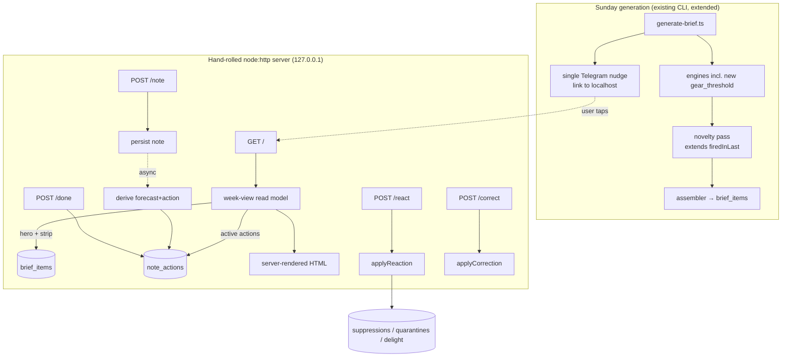

# feat: Copilot Web Weekly Surface

## Summary

Replace the seven-message Telegram brief with a solo, locally-hosted web "week view." A thin Sunday Telegram nudge links into a hand-rolled `node:http` page that leads with one high-novelty *non-calendar* forecast, demotes critical events to a strip, ranks by week-over-week novelty, and lets notes compound into forecasts-with-actions (with selective "done?" tracking on time-critical one-shots). Adds one new weight/gear-threshold engine. Most of the work extends machinery that already ships — the engine surface, the reactions/suppression/quarantine loop, and the spine.

---

## Problem Frame

After ~2 weeks of use the intelligence layer is winning and the delivery layer is failing: Telegram is buggy, the four reaction buttons are confusing, the brief arrives as seven long messages, and week-over-week content barely changes. The product produces no *delight* — the "I'm a better father/partner" feeling that comes from a novel, stress-mitigating, or connection-enabling forecast surfacing at the right moment (see origin: `docs/brainstorms/2026-06-10-web-weekly-surface-requirements.md`). This plan moves delivery to a web surface engineered to protect that one "oh man" moment and to make notes compound, while reusing the existing forecasting and feedback infrastructure.

---

## Key Technical Decisions

- **KTD1 — Hand-rolled `node:http` server, server-rendered HTML, no web framework.** Matches the only existing HTTP precedent in the repo (`src/cli/auth-google.ts`, an `node:http` loopback bound to `127.0.0.1`), adds zero dependencies, and is sufficient for the five routes (week view GET + react/correct/note/done POSTs). Bind `127.0.0.1` only — local-only deployment *is* the auth gate (see origin Key Decisions; no auth model built for v1). Alternative considered: a lightweight framework (Hono) for routing/static-serving — rejected for v1 as an unnecessary dependency at this route count; swapping one in post-PMF is a contained change.

- **KTD2 — Web engagement calls the existing reaction libraries directly; the Telegram HMAC machinery is not ported.** `applyReaction` (`src/lib/reactions.ts`) and `applyCorrection` (`src/lib/correct.ts`) are transport-agnostic and become the web handlers' backend. The HMAC callback signing in `src/lib/telegram.ts` exists to defend against attacker-controllable Telegram `callback_data` — a problem a local-only page acting directly on the DB does not have. The web surface inherits reaction *semantics*, not transport security. Idempotency (today keyed on `telegramCallbackId`) is re-provided web-side via a per-render nonce plus disable-after-tap, so a double-submit does not double-apply.

- **KTD3 — Note-derived actions get a purpose-built `note_actions` table, not the `suppressions` table.** AE2 requires two resurfacing conditions on one action: surface ~2 weeks *before* a projected weight-crossing date, *and* auto-clear when a measured `weight_kg` actually crosses the threshold. A `suppressions` row holds only one `revalidationKind`, so reusing it would force two linked rows and brittle coordination. A dedicated table carries both a `surface_on_or_after` date and a `clear_when` measurement band in one row, honoring AE2 directly. The R10 "done?" state is a nullable `completed_at` column on this same table, gated to one-shot actions — so the entire note→action feature adds exactly one new table (minimizing the test-DDL-lockstep cost called out in Risks).

- **KTD4 — The gear/weight-threshold engine models on the existing carseat sub-module.** `carseatOutgrowingCandidate` in `src/lib/engine/outgrowing.ts` already does "project weight forward → compare to a kg threshold → emit a candidate citing a gear spine path." The new engine reuses `WEIGHT_GAIN_BANDS` / `projectWeightForward` / `weeksUntilTargetWeight` from `src/lib/kb/outgrowing.ts`. It is **suppression-only** (no `FactTarget` — the union has no gear kind and inventing one is out of scope). For AE2's *observed* rate ("~0.4 lb/week"), compute slope from the two most recent `weight_kg` readings when available, falling back to KB-median projection from a single reading.

- **KTD5 — Novelty ranking extends `firedInLast`, not a new history store.** `firedInLast(kidId, triggerDetail, weeksBack, asOf)` in `src/lib/engine/suppression.ts` already answers "did this `(kid, triggerDetail)` headline a recent brief?" The novelty pass computes a separate novelty score from this, used by the web hero-selection sort — the assembler's `rawScore`/`priority`/`MAX_ITEMS` model is left intact so the existing brief pipeline and tests are undisturbed.

- **KTD6 — The web server reuses the shared `db` singleton.** `src/lib/db/index.ts` is WAL-mode (`foreign_keys = ON`); a long-running local server importing the same singleton coexists safely with the `generate-brief` CLI (WAL supports concurrent readers + one writer). The server is read-mostly; its writes (reactions, notes, done-toggles) are small and brief.

- **KTD7 — The note→action LLM derivation runs off the request hot path.** A note POST persists the raw note and returns immediately; an async step (mirroring the fire-and-forget pattern in `src/cli/bot.ts` → `applyCorrection`) lets Claude derive the forecast, recommended action, action kind, and surfacing conditions, then writes the `note_actions` row. The derived action appears on the next week-view render rather than blocking the POST.

---

## High-Level Technical Design

The week view merges three data sources at render time; engagement and notes write back through existing libraries plus the one new table.



**Hero vs strip partition:** calendar-derived items (`triggerDetail` prefixes `crossproduct`, `absence`, `vaccine_prep`) → events strip; everything else → hero candidate pool, sorted by novelty score, top one is the hero.

---

## Output Structure

New files introduced (per-unit `**Files:**` remain authoritative):

```
src/
├── cli/
│   └── web.ts                      # U4 — long-running node:http server entry
├── lib/
│   ├── engine/
│   │   ├── gear_threshold.ts       # U1 — new engine
│   │   ├── novelty.ts              # U2 — week-over-week scoring pass
│   │   └── week_view.ts            # U3 — hero/strip/actions read model
│   ├── kb/
│   │   └── gear.ts                 # U1 — sleep-sack / gear thresholds by weight
│   ├── web/
│   │   ├── render_week.ts          # U4 — HTML rendering
│   │   └── handlers.ts             # U5/U6/U7 — POST endpoint logic
│   └── note_action.ts              # U6 — note→forecast→action pipeline
tests/
├── gear_threshold.test.ts          # U1
├── novelty.test.ts                 # U2
├── week_view.test.ts               # U3
├── web_server.test.ts              # U4
├── web_engagement.test.ts          # U5
├── note_action.test.ts             # U6
└── web_done.test.ts                # U7
```

---

## Implementation Units

### U1. Weight/gear-threshold engine + knowledge base

**Goal:** Forecast gear transitions keyed to a weight crossing (sleep-sack size at a weight; reuse the model for car-seat-stage where useful), the gap that missed Jude's sleep-sack upgrade.
**Requirements:** R12; supports AE2.
**Dependencies:** none.
**Files:** `src/lib/kb/gear.ts` (new), `src/lib/engine/gear_threshold.ts` (new), `src/cli/generate-brief.ts` (wire in, ~line 144), `tests/gear_threshold.test.ts` (new).
**Approach:** Model on `carseatOutgrowingCandidate` in `src/lib/engine/outgrowing.ts`. `gear.ts` encodes sleep-sack-size-by-weight thresholds as typed arrays with a `source` string (mirror `SHOE_REPLACEMENT_BANDS` / `CARSEAT_OUTGROWING`). Engine reads latest `weight_kg` via the `measurements` table, projects forward with `projectWeightForward`/`weeksUntilTargetWeight` (reuse from `src/lib/kb/outgrowing.ts`), and prefers a per-kid spine override (`gear.sleep_sack` subtree, read via the loose-object accessors in `src/lib/context.ts`) over the KB default. Emits a `Candidate` with `citedRecord: { kidSpineId, path: "gear.sleep_sack" }`, `triggerSource: "lookahead"`, `triggerDetail: "outgrowing:sleep_sack"` (named under `outgrowing:` to inherit `measurement_band` revalidation — add `sleep_sack → "weight_kg"` to `OUTGROWING_MEASUREMENT` in `src/lib/reactions.ts`), `factTarget: undefined` (suppression-only), and `reasoning` citing the exact weight reading + threshold. **Unit trap:** thresholds are stated in lb, schema stores `weight_kg` — convert at the boundary.
**Patterns to follow:** `src/lib/engine/outgrowing.ts` (carseat sub-module), `src/lib/kb/outgrowing.ts` (projection helpers), `src/lib/engine/allergen_window.ts` (clean context-driven engine shape; return `[]` to stay silent).
**Test scenarios:**
- Happy path: a kid 0.5 kg below the sleep-sack threshold with a recent `weight_kg` reading produces one candidate with the right cited path, triggerDetail, and a reasoning string naming the reading and threshold.
- Covers AE2. Given two recent `weight_kg` readings ~0.4 lb/week apart, the projected crossing date is computed from the observed slope (not KB median) and named in the candidate.
- Edge: no `weight_kg` measurement → returns `[]` (no data, no signal).
- Edge: kid already above threshold → no candidate (or a "size up now" candidate per KB rule — assert the chosen rule explicitly).
- Edge: per-kid spine override (`gear.sleep_sack.size_up_at_lb`) takes precedence over the KB default.
- Unit conversion: an 18 lb threshold matches against a stored `weight_kg` value correctly.
**Verification:** `npm run generate-brief -- --dry-run` surfaces a sleep-sack candidate for a kid seeded near the threshold; new tests pass.

### U2. Novelty / week-over-week ranking signal

**Goal:** Rank items by what's *newly true or newly relevant* this week so standing facts stop re-headlining (the staleness complaint).
**Requirements:** R4.
**Dependencies:** none.
**Files:** `src/lib/engine/novelty.ts` (new), `src/lib/engine/suppression.ts` (extend/export `firedInLast` usage), `tests/novelty.test.ts` (new).
**Approach:** A pure pass over a candidate array (plus the kid id and `asOf`) returning a novelty score per candidate. Use `firedInLast(kidId, triggerDetail, weeksBack, asOf)` to detect recent appearances: a `(kid, triggerDetail)` that headlined recent briefs is penalized; a first-time or newly-fired one is boosted. Keep the score separate from `rawScore` — do not mutate the assembler's ranking. Expose a function the week-view read model (U3) consumes.
**Patterns to follow:** `src/lib/engine/candidate_filter.ts` (pure pass over candidates), `firedInLast` in `src/lib/engine/suppression.ts`.
**Test scenarios:**
- Covers R4. A candidate whose `triggerDetail` appeared in each of the last 3 weekly briefs scores lower than an identical-`rawScore` candidate appearing for the first time.
- A candidate not fired in the lookback window receives the newness boost.
- Empty brief history → all candidates treated as novel (no penalty), no crash.
- Family-level (`kidId: null`) candidates are scored without throwing on the null kid id.
**Verification:** Given a seeded multi-week `brief_items` history, the novelty pass orders a fresh forecast above a repeated standing fact.

### U3. Week-view read model (hero / strip / active actions)

**Goal:** Produce the structured data the page renders: one hero (highest-novelty non-calendar item), the events strip, and active note-actions.
**Requirements:** R2, R3, R4 (consumes U2); surfaces U6 actions.
**Dependencies:** U2; reads the `note_actions` table created in U6 (degrade to empty when the table has no active rows).
**Files:** `src/lib/engine/week_view.ts` (new), `tests/week_view.test.ts` (new).
**Approach:** Read the latest brief's `brief_items` for the week. Partition by `triggerDetail` prefix: calendar-derived (`crossproduct`, `absence`, `vaccine_prep`) → events strip; everything else → hero pool. Apply U2 novelty scoring to the hero pool and select the top item as hero. Query `note_actions` for currently-surfaceable rows (`surface_on_or_after <= asOf AND completed_at IS NULL AND clear_when not yet crossed`) and include them. Carry each item's persisted `citedRecord` straight from the row (do **not** re-derive a kid slug — slug instability gotcha). Return a typed `WeekView` object; render is U4's job.
**Patterns to follow:** read-only query style in `src/lib/deliver.ts`; `resolveKidSpineId` policy in `src/lib/context.ts` (but prefer the persisted `citedRecord`).
**Test scenarios:**
- Covers R2. A week with a non-calendar forecast and three appointments puts the forecast in the hero slot and the appointments in the strip.
- Covers R2, R4. A week whose only "new" things are calendar events plus an unchanged developmental window already shown last week still selects a non-calendar hero (the newly-relevant item), and the unchanged window does not headline.
- Covers R3. Calendar-derived items never appear as the hero.
- Active note-action rows are included; completed or not-yet-surfaceable ones are excluded.
- No brief for the week → an empty-but-valid WeekView (page can render "nothing new").
**Verification:** Read model returns the expected hero/strip/actions split against a seeded DB.

### U4. Hand-rolled local web server + server-rendered week view

**Goal:** Serve the week view at `http://127.0.0.1:<port>/` as the destination the Sunday nudge links to.
**Requirements:** R1; link target for R7.
**Dependencies:** U3.
**Files:** `src/cli/web.ts` (new, long-running entry), `src/lib/web/render_week.ts` (new), `package.json` (add `web` script: `tsx --env-file=.env src/cli/web.ts`), `tests/web_server.test.ts` (new).
**Approach:** `node:http` `createServer`, bind `127.0.0.1`, port from `process.env.COPILOT_WEB_PORT` (default e.g. 4317) following the existing direct-`process.env` convention. Route `GET /` → call U3 read model → `render_week.ts` returns a single self-contained HTML document (inline CSS; minimal/no client JS beyond small fetch handlers added in U5). Import the shared `db` singleton. Model the server scaffold on the `node:http` loopback in `src/cli/auth-google.ts`. Graceful 404 for unknown routes; the page renders a calm "nothing new this week" state when the WeekView is empty.
**Patterns to follow:** `src/cli/auth-google.ts` (`createServer`, `127.0.0.1` bind, request handling), the graceful-degradation style throughout `src/cli/generate-brief.ts`.
**Execution note:** Start with a failing integration test that boots the server on an ephemeral port and asserts the rendered hero/strip against a seeded temp DB.
**Test scenarios:**
- Covers R1. `GET /` returns 200 with HTML containing the hero headline and the events strip for a seeded week.
- The hero is visually/structurally distinct from the strip (assert the hero markup region contains the non-calendar item).
- Empty week → 200 with the calm empty-state copy, not an error.
- Unknown path → 404.
- Integration: the server reads the same temp DB the test seeded (set `COPILOT_DB_PATH` before dynamic import; boot on an ephemeral port).
**Verification:** `npm run web` serves a readable week view in a browser at the local URL.

### U5. Engagement endpoints (reactions + correction)

**Goal:** Replace the four confusing Telegram buttons with web-native engagement that reuses the existing reaction loop.
**Requirements:** R6; advances R11.
**Dependencies:** U4.
**Files:** `src/lib/web/handlers.ts` (new), `src/cli/web.ts` (wire routes), `src/lib/web/render_week.ts` (add per-item controls), `tests/web_engagement.test.ts` (new).
**Approach:** `POST /react` with `{ briefItemId, reaction }` → call `applyReaction` (`src/lib/reactions.ts`) with a web-generated idempotency key (per-render nonce) in place of `telegramCallbackId`. `POST /correct` with `{ briefItemId, text }` → call `applyCorrection` (`src/lib/correct.ts`), reusing the existing async correction path. Render the four reactions as clear, labeled controls (the redesign that fixes "confusing buttons") that disable after submit (client-side double-submit guard) and reflect the resulting state on reload. Carry the persisted `citedRecord` from the row, never re-derive.
**Patterns to follow:** callback + reply handlers in `src/cli/bot.ts` (but skip `verifyCallback`/HMAC); `applyReaction` dispatch in `src/lib/reactions.ts`.
**Test scenarios:**
- Covers R6/R11. `POST /react` `handled` upserts a suppression and inserts a delight candidate for the cited record.
- `already_knew` clears the milestone / adds to things-we-already-know without a delight row.
- `wrong` quarantines the cited record and parks a pending correction; `POST /correct` then applies it and lifts the quarantine.
- Idempotency: the same reaction submitted twice (same nonce) applies once (`noop_duplicate` equivalent).
- Family-level (`kidId: null`) `wrong` is logged but not quarantined (matches existing semantics; the known family-level wrinkle).
- Error path: a `briefItemId` that doesn't exist → 4xx, no mutation.
**Verification:** Reacting in the browser updates the spine/suppression tables exactly as a Telegram tap does today.

### U6. Note → forecast → action pipeline + `note_actions` table

**Goal:** Make a note compound into a forecast plus a recommended action that resurfaces at the right moment — the core "watch it return forward value" loop.
**Requirements:** R5, R8, R9; honors AE2.
**Dependencies:** U4 (endpoint), U1 (weight projection helpers).
**Files:** `src/lib/db/schema.ts` (add `note_actions` table + type exports), `src/lib/note_action.ts` (new pipeline), `src/lib/web/handlers.ts` (add `POST /note`), `src/lib/web/render_week.ts` (render active actions), `tests/note_action.test.ts` (new), plus **every test that hand-rolls DDL** (add the new table in lockstep — see Risks).
**Approach:** `note_actions` columns: `id`, `kidSpineId`, `sourceNote` (text), `forecastText`, `actionText`, `actionKind` (`ambient` | `one_shot`), `surfaceOnOrAfter` (ISO date, nullable), `clearWhen` (JSON measurement band, nullable), `completedAt` (ISO, nullable — U7), `createdAt`. `POST /note` persists the raw note and returns immediately (KTD7). An async derivation step (mirror `src/cli/bot.ts` → `applyCorrection` fire-and-forget) calls Claude to produce `{forecastText, actionText, actionKind, surfaceOnOrAfter, clearWhen}`; for a weight-keyed note it computes `surfaceOnOrAfter` from `weeksUntilTargetWeight` (~2 weeks before projected crossing) **and** sets `clearWhen` to the `weight_kg` band — both on one row, honoring AE2. The U3 read model surfaces rows whose date has arrived and whose band hasn't been crossed; a later `weight_kg` measurement crossing the band makes the row stop surfacing (auto-clear). Script-produces / model-presents discipline: the LLM derives content, deterministic code computes dates/bands.
**Patterns to follow:** `src/lib/correct.ts` (LLM-derives-then-deterministic-write, off hot path), `src/lib/spine_write.ts` (validated writes), the `measurement_band` shape in `src/lib/reactions.ts` (`deriveRevalidation`).
**Execution note:** Add the `note_actions` table to `schema.ts` and apply via `drizzle-kit push` as a *new table* (pushes cleanly; avoids the `db:push`-on-existing-index quirk). Then add the table's `CREATE TABLE` to every test's hand-rolled DDL before running the suite.
**Test scenarios:**
- Covers AE2. A note "bigger sleep sack at 18 lb" while Jude is 17.2 lb derives a row with `actionKind: one_shot`, `surfaceOnOrAfter` ≈ 2 weeks before the projected crossing, and a `clearWhen` weight band; it surfaces only once the date arrives.
- Covers AE2 (auto-clear). After a `weight_kg` reading crosses the band, the read model stops surfacing the row even though `completedAt` is null.
- Covers R8. A note never re-appears verbatim as a stored receipt — the surfaced item is the derived forecast+action, not the raw note text.
- `POST /note` returns promptly before the async derivation completes (hot path is not blocked).
- An ambient/connection note (no weight key) derives `actionKind: ambient`, no `surfaceOnOrAfter`/`clearWhen`, and simply appears in the next view.
- Derivation failure (LLM error) leaves the raw note persisted and surfaces nothing broken (graceful).
**Verification:** Leaving the sleep-sack note produces a held action that appears ~2 weeks out and clears on the crossing measurement, end to end against a seeded DB.

### U7. Selective "done?" tracking for one-shot actions

**Goal:** Let time-critical, one-shot actions be marked done so they don't slip — without turning the surface into a to-do list.
**Requirements:** R10.
**Dependencies:** U6.
**Files:** `src/lib/web/handlers.ts` (`POST /done`), `src/lib/web/render_week.ts` (done control on one-shot actions only), `src/lib/engine/week_view.ts` (exclude completed rows — already in U3 query), `tests/web_done.test.ts` (new).
**Approach:** `POST /done` with `{ noteActionId }` sets `completed_at`. The done control renders **only** for `actionKind: one_shot` rows; ambient actions never show it (the discipline that keeps tracking an exception, not the default). Completed rows drop out of the week view.
**Patterns to follow:** the small-write handler shape from U5.
**Test scenarios:**
- Covers R10. `POST /done` on a one-shot action sets `completed_at` and the action disappears from the next render.
- An ambient action exposes no done control (assert absence in rendered markup).
- Idempotent: marking an already-done action again is a no-op, not an error.
- A `noteActionId` that doesn't exist → 4xx, no mutation.
**Verification:** A one-shot action can be checked off in the browser and stays gone; ambient actions have no checkbox.

### U8. Trim delivery to a single Sunday Telegram nudge

**Goal:** Replace the seven-message brief send with one thin nudge linking into the web view (R7), keeping Telegram only as the link-carrier (provisional-until-PMF).
**Requirements:** R7.
**Dependencies:** U4 (needs the local URL).
**Files:** `src/lib/deliver.ts` (replace per-item send with a single nudge), `src/cli/generate-brief.ts` (call the trimmed delivery), `tests/deliver.test.ts` (update existing delivery tests), `src/lib/telegram.ts` (reuse `getBot`/`sendMessage`; the per-item keyboard/HMAC path becomes unused for the web flow — leave intact or mark vestigial).
**Approach:** After assembly, send one Telegram message via `bot.api.sendMessage`: a one-line teaser (e.g. "This week: N new things for the kids") plus a link to `http://127.0.0.1:<port>/`. Do not send individual items or inline keyboards. Keep `deliverBrief`'s delivery-stamp semantics only if still needed; otherwise the nudge is fire-and-forget with the existing `not_configured` short-circuit. The teaser count should reflect the week-view hero + actionable items, not the old 7-item cap.
**Patterns to follow:** `getBot`/dry-run handling in `src/lib/telegram.ts`; the configured/not-configured short-circuit in `src/lib/deliver.ts`.
**Test scenarios:**
- Covers R7. Generation sends exactly one Telegram message containing the local link (assert against the injectable send seam used in `tests/deliver.test.ts`).
- Dry-run mode (`COPILOT_TELEGRAM_DRYRUN=1`) sends nothing and does not throw.
- Not-configured Telegram → generation still completes and writes the brief; nudge is skipped.
- The teaser text reflects the actual count of surfaced items.
**Verification:** `npm run generate-brief` results in a single nudge in Telegram whose link opens the week view.

---

## Scope Boundaries

**Deferred for later (from origin):**
- Mika / shared / multi-user access — solo must prove delight first.
- Growth/gear *trend charts* as a hero feature (the gear *trigger* is in scope via U1; longitudinal visualization is not).
- The "Living Kid Card" framing — natural evolution once the loop is proven.

**Outside this product's identity (from origin):**
- A full task manager — selective `done?` (U7) is a bounded exception, not general task tracking.
- A calendar replacement — the events strip surfaces, it does not manage.
- A conversational chat surface to feed — notes seed forecasts; the page is not a chat assistant.

**Deferred to follow-up work (plan-local):**
- Extending the `FactTarget` union with a gear kind (U1 is suppression-only for v1).
- Migrating the nudge off Telegram and the server off local hosting (both revisit at PMF, per origin).
- Capturing `docs/solutions/` learnings after this lands (the repo has none yet; recommended via `/ce-compound`).
- A real authentication model — deferred until hosted/multi-user makes it load-bearing.

---

## Risks & Dependencies

- **Test → real-DB leak (the load-time `db` singleton).** `src/lib/db/index.ts` opens the DB at module load from `COPILOT_DB_PATH ?? "./data/copilot.db"`. Every new test (and the web-server boot in tests) MUST set `COPILOT_DB_PATH` to a temp path *before* any import that transitively loads `db/index.ts`, then use dynamic `await import(...)`. Follow the established pattern in `tests/deliver.test.ts`.
- **Hand-rolled DDL must add `note_actions` in lockstep.** Tests hand-roll `CREATE TABLE` rather than running migrations. When U6 adds the table to `schema.ts`, every DB-touching test's setup must add the matching `CREATE TABLE` or tests silently diverge from the real schema. New table only — no ALTER on existing tables — to sidestep the known `db:push`-on-existing-index quirk.
- **Concurrent writers.** `generate-brief` (Sunday) and the always-on web server both open the WAL-mode DB. WAL allows concurrent readers + one writer; keep web writes short (they are). Two simultaneous writers serialize — acceptable at this scale.
- **LLM on the note path.** Synchronous derivation would make `POST /note` slow and failure-prone; KTD7 moves it off the hot path. Derivation failure must leave the raw note intact and surface nothing broken.
- **Slug instability.** Family-level/crossproduct items resolve to `"family"` or name slugs. The web layer must carry the persisted `citedRecord` from the row, never re-derive a slug.
- **Operational dependency:** the web server is a new long-running process. The Sunday nudge is useless if the server isn't running — see Operational Notes.

---

## Operational / Rollout Notes

- The web server (`npm run web`) is a third long-running process alongside the always-on bot ("Eugene"). For the Sunday nudge link to work on tap, the server must be running continuously — add a launchd agent mirroring `com.copilot.bot` (RunAtLoad + KeepAlive), logging to `~/Library/Logs/copilot-web.log`. (Operational setup, not a code unit.)
- Choose a stable local port (`COPILOT_WEB_PORT`, default 4317) so the nudge link is constant across restarts.
- The existing `com.copilot.generate-brief` launchd agent is unchanged; only what it *delivers* changes (U8).

---

## Sources & Research

- Origin requirements: `docs/brainstorms/2026-06-10-web-weekly-surface-requirements.md`.
- Existing HTTP precedent: `src/cli/auth-google.ts` (`node:http` loopback, `127.0.0.1` bind).
- Brief pipeline: `src/cli/generate-brief.ts`, `src/lib/engine/assembler.ts`, `candidate_filter.ts`, `suppression.ts` (`firedInLast`), `types.ts` (Candidate shape).
- Reaction loop: `src/lib/reactions.ts` (`applyReaction`, `deriveRevalidation`), `src/lib/correct.ts` (`applyCorrection`), `src/lib/deliver.ts`, `src/lib/telegram.ts` (HMAC — intentionally not ported).
- Engine/KB pattern: `src/lib/engine/outgrowing.ts` (carseat sub-module), `src/lib/kb/outgrowing.ts` (`projectWeightForward`, `weeksUntilTargetWeight`), `src/lib/engine/allergen_window.ts`.
- Spine: `src/lib/context.ts` (loose-inside/strict-outside accessors), `src/lib/spine_write.ts`.
- Test discipline: `tests/deliver.test.ts` (temp DB + dynamic import pattern).
- Prior plan with transferable patterns: `docs/plans/2026-06-05-001-feat-weekly-loop-telegram-plan.md` (idempotent mutation, deterministic-produces / LLM-presents, explicit handoff records).
- `docs/solutions/` does not exist yet — no prior learnings; capture after this lands.
